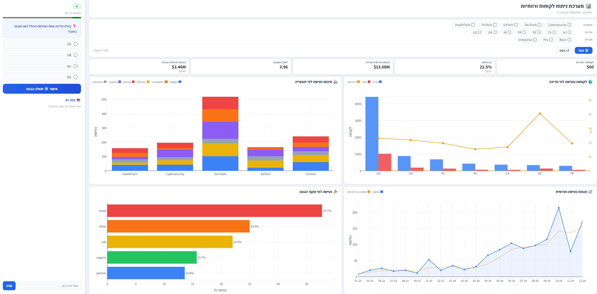
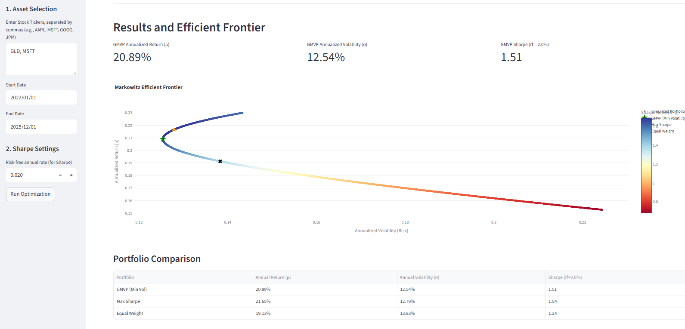
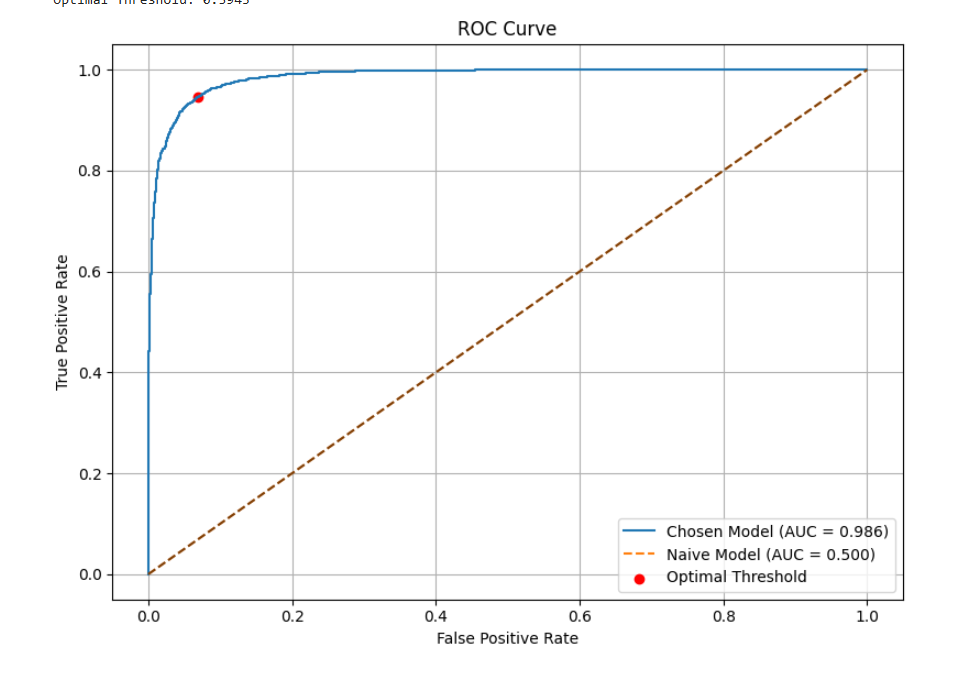

<!-- Top Navigation Bar -->

<nav class="top-nav">
  <ul>
    <li><a href="#about">About</a></li>
    <li><a href="#experience">Experience</a></li>
    <li><a href="#skills">Skills</a></li>
    <li><a href="#projects">Projects</a></li>
    <li><a href="#resume">Resume</a></li>
  </ul>
</nav>

## 📌 About Me  

**Sapir Gabay** - Industrial Engineering & Management graduate, Ben-Gurion University (Intelligent Systems, GPA 87)

- Building ETL pipelines and Power BI dashboards with large-scale datasets (millions of rows) for tech and SaaS companies, analyzing ARR, Churn, Cohort retention, and other key metrics
- Evaluated deep-tech startups and built an early-stage investor community at BGU's entrepreneurship center
- Hands-on builder - SQL, Python, and independent AI/automation projects (n8n, Claude Code)

*A few projects I've worked on:*

---
## 💻 Technical Skillset 

| **Programming & Data** | Python (Pandas, Scikit-learn), SQL, Java, Streamlit, Power BI, Tableau, Alteryx, Excel (Pivot Tables, Power Query, VBA) |
| **Machine Learning** | Sentiment Classification, Decision Trees, MLP, SVM |
| **AI, Automation & Deployment** | REST APIs, Claude Code, n8n, Netlify, GitHub |

---
## 🚀 Projects 

  

    <h3>A/B Testing for LLM Impact (Final Thesis)</h3>
    

      Built a Python-based A/B testing environment using the OpenAI API to evaluate
      LLM impact on user decision-making within BI dashboards.
    

  

  

    
  

  

    <h3>Interactive Portfolio Optimization</h3>
    

      An interactive web application demonstrating Modern Portfolio Theory (Markowitz Model).
      Built in Python and deployed with Streamlit. Analyzes risk, return, and optimal asset
      allocation for investors.
    

    

      <a href="https://markowitz-portfolio-optimizer.streamlit.app/" target="_blank">
        Open live app
      </a>
    

  

  

    
  

  

    <h3>Machine Learning: Sentiment Classification</h3>
    

      Demonstrates a full ML workflow on Twitter text data, including preprocessing,
      feature engineering, model comparison and evaluation.
    

    

      <a href="projects/ml_sentiment_analysis.html">
        Project Link
      </a>
    

  

  

    
  

### Core ML Implementation: Decision Tree from Scratch  
[Project Link](projects/decision_tree_from_scratch.html)  
Implemented core ML algorithms (Decision Tree, K-Means, Chi-Squared Pruning) from scratch.

---
## 📄 Resume 
[Download Full Resume (PDF)](https://drive.google.com/file/d/10iCzBdPtQXleXRPWRyD9qYYb6Oky6kcy/view?usp=sharing)
